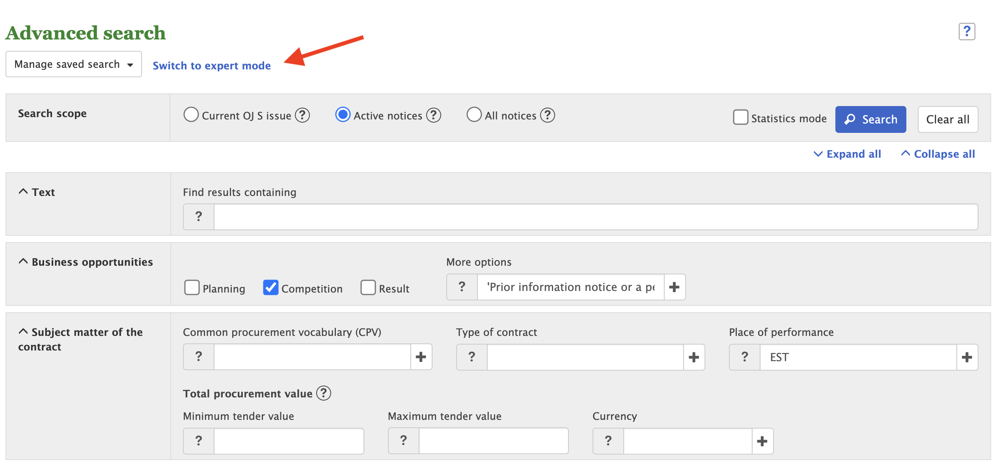
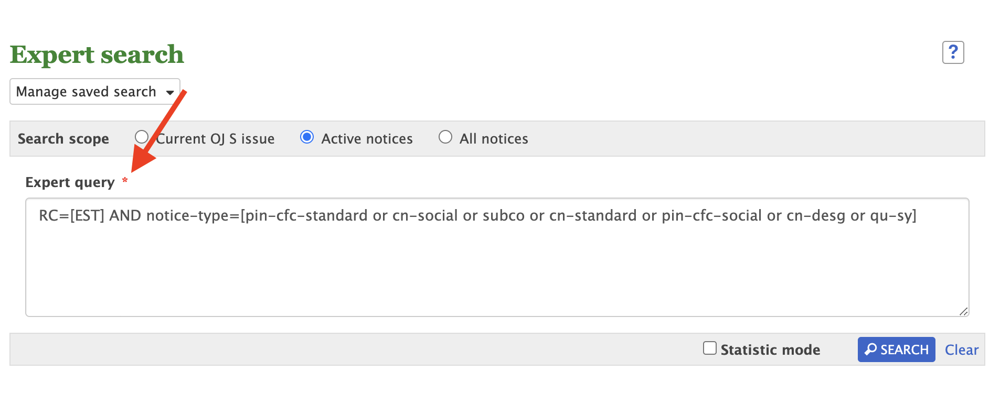

[](https://github.com/flexponsive/tap-eu-ted/actions/workflows/lint.yml)
[](https://github.com/flexponsive/tap-eu-ted/actions/workflows/test.yml)

# tap-eu-ted

`tap-eu-ted` is a Singer tap that reads data about public procurement in the European Union from [Tenders Electronic Daily](https://ted.europa.eu/TED/main/HomePage.do):

> TED (Tenders Electronic Daily) is the online version of the 'Supplement to the Official Journal' of the EU, dedicated to European public procurement.
> TED publishes 676 thousand procurement notices a year, including 258 thousand calls for tenders which are worth approximately €670 billion.

Built with the [Meltano Tap SDK](https://sdk.meltano.com) for Singer Taps. It retrieves data from TED with the [search-controller-v-3](https://ted.europa.eu/api/swagger-ui.html#/search-controller-v-3/searchPostUsingPOST_2).


## Installation


Install from GitHub:

```bash
pipx install git+https://github.com/flexponsive/tap-eu-ted.git@main
```

## Configuration

### Accepted Config Options

It is required to specify a `query` setting to select the documents the tap will retrieve. The query will be processed by the remote API, and are not aware of documentation on the query language. The easiest way to assemble a query is through the TED website:

**Step 1.** Go to [Advanced Search](https://ted.europa.eu/TED/search/search.do) on the TED website, select your query and then click "Switch to expert mode":



**Step 2.** Paste the expert query to the tap configuration



By default, the tap sets the `scope` to all documents; this can be changed to e.g. active notices only (setting `scope` to 2).

A full list of supported settings and capabilities for this
tap is available by running:

```bash
tap-eu-ted --about
```

### Configure using environment variables

This Singer tap will automatically import any environment variables within the working directory's
`.env` if the `--config=ENV` is provided, such that config values will be considered if a matching
environment variable is set either in the terminal context or in the `.env` file.

### Source Authentication and Authorization

This open data API does not require authentication.

## Usage

You can easily run `tap-eu-ted` by itself or in a pipeline using [Meltano](https://meltano.com/).

### Executing the Tap Directly

```bash
tap-eu-ted --version
tap-eu-ted --help

# example: replicate all notices from estonia
echo '{ "query": "RC=[EST]", "start_date" : "2023-01-01" }' > tap_config_test.json
tap-eu-ted --config tap_config_test.json

# example 2: incremental replication after 2023-02-01
echo '{"bookmarks": {"documents": {"replication_key": "pubdate", "replication_key_value": "2023-02-01"}}}' > state_test.json
tap-eu-ted --config tap_config_test.json --state state_test.json
```

## Developer Resources


### Initialize your Development Environment

```bash
pipx install poetry
poetry install
```

### Create and Run Tests

Create tests within the `tap_eu_ted/tests` subfolder and
  then run:

```bash
poetry run pytest
```

You can also test the `tap-eu-ted` CLI interface directly using `poetry run`:

```bash
poetry run tap-eu-ted --help
```

### Testing with [Meltano](https://www.meltano.com)

_**Note:** This tap will work in any Singer environment and does not require Meltano.
Examples here are for convenience and to streamline end-to-end orchestration scenarios._

<!--
Developer TODO:
Your project comes with a custom `meltano.yml` project file already created. Open the `meltano.yml` and follow any "TODO" items listed in
the file.
-->

Next, install Meltano (if you haven't already) and any needed plugins:

```bash
# Install meltano
pipx install meltano
# Initialize meltano within this directory
cd tap-eu-ted
meltano install
```

Now you can test and orchestrate using Meltano:

```bash
# Test invocation:
meltano invoke tap-eu-ted --version
# OR run a test `elt` pipeline:
meltano elt tap-eu-ted target-jsonl
```

### SDK Dev Guide

See the [dev guide](https://sdk.meltano.com/en/latest/dev_guide.html) for more instructions on how to use the SDK to
develop your own taps and targets.
